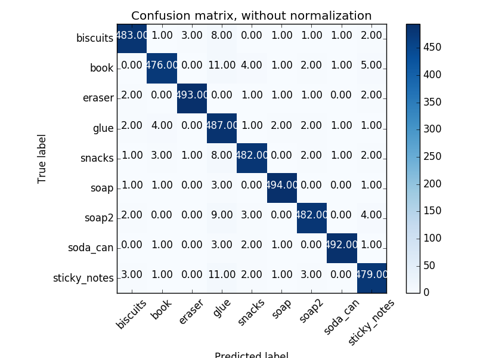
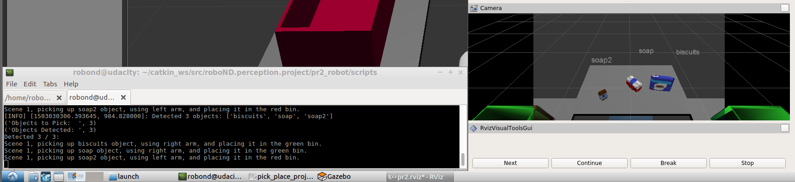
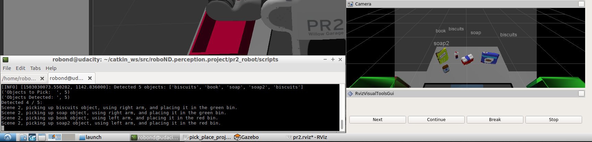
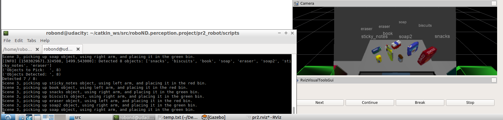

# Project: Perception Pick & Place


The main project files are:

* sensor_stick/src/sensor_stick/features.py : Creating Feature Vectors
* perception/pr2_robot/scripts/project.py : **main project file**
* perception/pr2_robot/scripts/detection_workflow.py : all functions used for the object recognition pipeline
* perception/pr2_robot/scripts/capture_features.py : the script used to capture training data
* perception/pr2_robot/scripts/train_svm.py : the script used to train the svm using the captured data
* perception/pr2_robot/scripts/model.sav : the generated model

- sensor_stick/models has been deleted to save space (included in original exercise)

## Usage

* **run stick world**: roslaunch sensor_stick training.launch
* **in another tab to capture features** (from inside scripts folder): ./capture_features.py 
* **after capturing is over start training**: ./train_svm.py
* **launch the pick and place world**: roslaunch pr2_robot pick_place_project.launch
* **run the code to detect objects**: ./project.py


## Exercise 1 & 2: Pipeline for filtering , RANSAC plane fitting and Cluster Segmentation.

* step 1: Statistical Outlier Removal -> detection_workflow.py -> statistical_filtering function
* step 2: Voxel Downsampling -> detection_workflow.py -> voxel_downsampling function
* step 3: Passthrough Filter -> detection_workflow.py -> passthrough_filtering function
* step 4: RANSAC plane fitting -> detection_workflow.py -> ransac_plane_segmentation function
* step 5: Cluster Segmentation -> detection_workflow.py -> euclidean_clustering & colorize_cluster functions

and the associated code in the project.py that implements the pipeline is:

```python
    # Exercise-1 & 2 pipeline:
    # 1: Convert ROS msg to PCL data
    pcl_data = ros_to_pcl(pcl_msg)
    # 2. Statistical Outlier Filtering
    pcl_data = statistical_filtering(pcl_data)
    # 3: Voxel Grid Downsampling
    pcl_data = voxel_downsampling(pcl_data, leaf_size=0.005)
    # 4: PassThrough Filter
    # 4a: filter out the floor
    pcl_data = passthrough_filtering(pcl_data, filter_axis='z',
                                     min_value=0.6, max_value=2.0)
    # 4b: filter out  drop boxes
    pcl_data = passthrough_filtering(pcl_data, filter_axis='y',
                                     min_value=-0.5, max_value=0.5)

    # 5: Create and Publish the collision map
    #          publish a point cloud to `/pr2/3D_map/points`.
    collision_map = pcl_to_ros(pcl_data)
    collision_map_pub.publish(collision_map)

    # 6: RANSAC Plane Segmentation (table, objects)
    pcl_inliers, pcl_outliers = ransac_plane_segmentation(pcl_data, plane_height=0.01)

    # 7: Euclidean Clustering (outliers == objects)
    cluster_indices = euclidean_clustering(pcl_outliers, tolerance=0.015,
                                           min_size=20, max_size=3000)

    # 8: Create Cluster-Mask Point Cloud to visualize each cluster separately
    white_cloud = XYZRGB_to_XYZ(pcl_outliers)
    colored_cloud = colorize_cluster(pcl_outliers, cluster_indices)
```

## Exercise 3: Features extracted and SVM trained.  Object recognition implemented.

The feature extraction is done in sensor_stick/src/sensor_stick/features.py . The feature vectors consist of : 

* HSV components, each has 32 entries (from the 32 bins of the histogram) , describing the distribution of the component in the trained object
* x,y components of the normal vectors, with 8 entries each. describing the distribution of normal vector component on the trained object.

z component is **omitted** , since it depends on x and y ( its a unit vector). Increasing the number of components, requires much more training data , and even those two components required **500 samples** per object. For fewer samples, using just the x component gives much better results.

The trained model achieved an accuracy of 96%. Below are the confusion matrix from the training session



and the normalized confusion matrix


## Pick and Place Setup

The 3 test worlds are used to test out the object recognition model. The outputs are saved in output_1.yaml, output_2.yaml, output_3.yaml, inside /perception/pr2_robot/scripts folder.
At the place coordinates, I added **random noise** in the x and y coordinates, to avoid the stacking pieces problem as reported in the lessons

The pipeline achieved the following results:
* world 1: 3/3 (100% - required 100%) 
* world 2: 4/5 (80% - required 80%)
* world 3: 7/8 (87.5% - required 75%)

and here are some images

world 1:



world 2:



world 3:




Spend some time at the end to discuss your code, what techniques you used, what worked and why, where the implementation might fail and how you might improve it if you were going to pursue this project further.  

## Remarks

* There is/was a big discussion on slack, about the feature vector extraction. A lot of students copied the bin range (0,256) from color vectors to normal vector histograms, practically ignoring normal vectors since it pushes all of them in the first bin. The results though are much better when we ignore the normal vectors, at least in this context, and require much fewer samples. I choose to follow the "correct" way and have reduced accuracy but use the normal vectors as instructed.

* I think using just the x-component of the normal vector will give better results, at this range of samples

* I decided not to complete the pick and place part of the project, the optional, because of lack of time, but it will be done later. Basically I need to update the collision map with the left and right sides of the world and then cycle through detection - action. For now I go through all objects and create all the yaml files at once.


